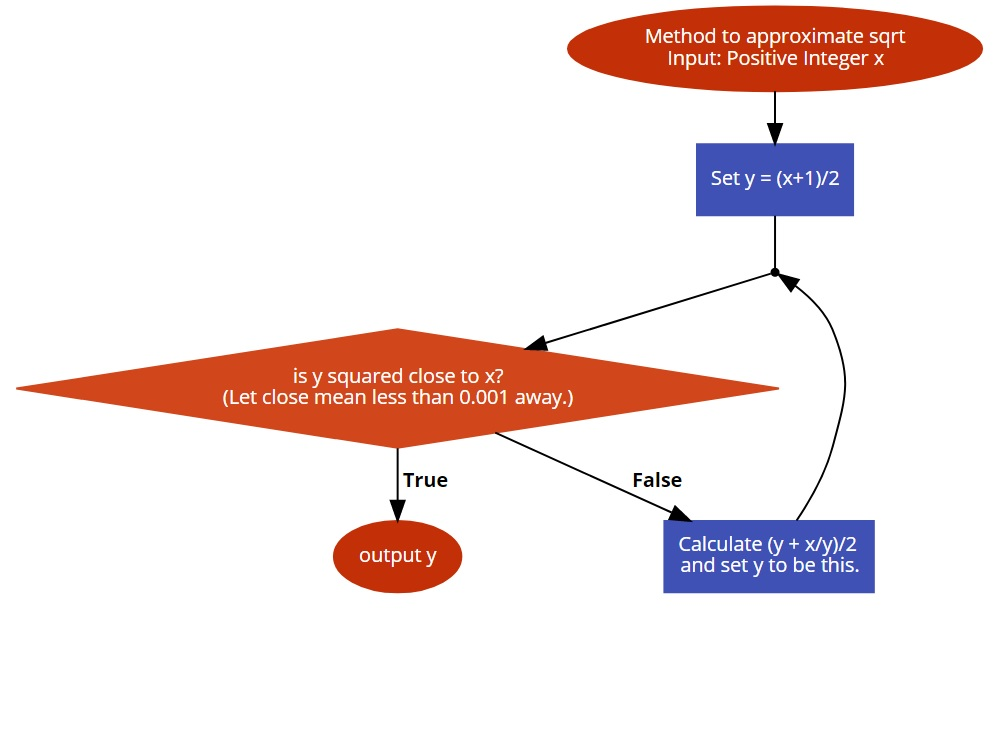

# 4003CEM-intro

## lab_welcome
In 4003CEM we will generally be asking you to write your answers in a seperate function and seperate file to your main() function in order to make it simpler to check that your code is producing the right output.

## lab_even
Write a function called is_even in the lab_even.h file which has a single integer argument.
The function should return a boolean, true if the argument is an even number and false otherwise.

## lab_leap
Write a function called is_leap in the lab_leap.h file which takes a single integer argument representing a year.
The function should return a boolean, true if the year is a leap year and false otherwise.

## lab_age
Using everything that you have learnt so far, convert the age() function in the lab_age.py file into C++.

## lab_fibonacci
Write a function called fibonacci in the lab_fibonacci.cpp file.
The function should print the first 20 elements in the fibonacci sequence. 
The sequence should start 0, 1, 1, 2 ....
Each element should be printed on a new line.

## lab_sqrt
Write a function called my_sqrt in the lab_sqrt.h file.
The function should return the square root of a given value.
The return value should be calculated using Newton's method, you may have already done this in Python as part of 4000CEM.

Take care when dividing numbers in C++, what happens if you divide an integer by an integer?

## lab_reverse
Using everything that you have learnt so far, convert the lab_reverse.py program into C++.
Note that I have provided you with a C++ version of Python input() function in order to make things simpler.

## lab_recursion
Write a function called is_palindrome in lab_recursion.h.
The function should return true or false to indicate if a given word is a palindrome. You should use recursion to solve this tasks and will need to look at the C++ documentation see what methods are available for C++ strings.